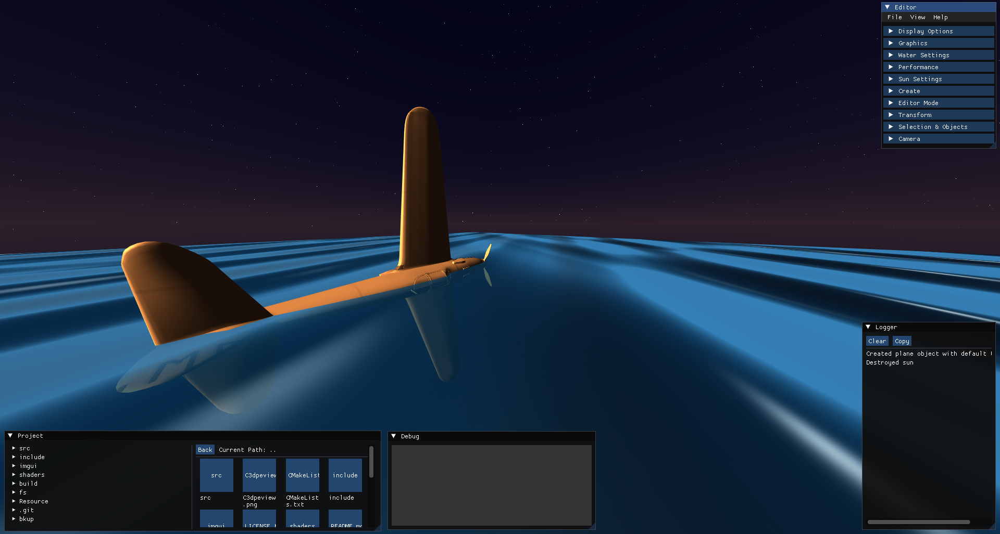

# Calcium3D Engine

**Calcium3D** is a lightweight 3D game engine and editor built from the ground up using modern C++ and OpenGL. It provides a feature-rich, real-time editing environment powered by Dear ImGui, along with a flexible rendering pipeline that supports various lighting models, atmospheric effects, and post-processing.

## stopping the development here {next update was this}
- Gravity
- Collision
- animation

## Core Features

The engine is organized into a modular architecture, with a clear separation between the rendering backend, editor UI, and scene management systems.

### Rendering Engine

The core of Calcium3D is a flexible renderer built on **OpenGL 3.3**.

- **Physically-Based & Custom Lighting:**
  - **Global Sun:** A configurable directional light source that acts as the sun, with adjustable color, intensity, and position presets (Dawn, Noon, Dusk).
  - **Local Point Lights:** Place multiple point lights within the scene for localized illumination.
- **Model & Material System:**
  - **Model Loading:** Supports `.obj` files (via `tinyobjloader`) and has foundational support for `.gltf`.
  - **Texture Mapping:** Applies diffuse and specular textures to models.
- **Atmospherics & Sky:**
  - **Dynamic Sky:** A procedural gradient-based sky that transitions between day and night, complete with a sun and moon.
  - **Static Skybox:** Supports traditional cubemap-based skyboxes.
  - **2D & Volumetric Clouds:** Render either fast, texture-based 2D clouds or performance-intensive ray-marched volumetric clouds.
- **Water System:**
  - Renders a dynamic water surface with simulated waves.
  - Supports two wave generation techniques: **Blinn-Wyvill** and **Gerstner waves**.
- **Post-Processing:**
  - **Framebuffer:** The entire scene is rendered to a framebuffer for post-processing effects.
  - **MSAA:** Multi-Sample Anti-Aliasing (2x, 4x, 8x) for smoother edges.
- **Object Highlighting & Outlines:** Selected objects are highlighted using a dedicated shader for clear visual feedback.

### In-Engine Editor

The editor provides a comprehensive suite of tools for real-time scene creation and manipulation, built with **Dear ImGui**.

- **Scene Management:**
  - **Object Primitives:** Create planes, cubes, and spheres with a single click.
  - **Scene Hierarchy:** All created objects are listed and can be managed.
  - **Duplicate & Delete:** Easily duplicate or remove objects from the scene.
- **Transformation Gizmos:**
  - Manipulate objects with intuitive **Translate**, **Rotate**, and **Scale** gizmos.
  - Axis-constrained controls for precise adjustments.
- **File Browser:**
  - A built-in file explorer to navigate project directories and manage assets.
  - Supports basic file operations like create, delete, copy, and paste.
- **Real-time Configuration:**
  - **Camera Controls:** Adjust FOV, near/far planes, movement speed, and mouse sensitivity.
  - **Graphics Settings:** Toggle VSync, MSAA levels, and switch between sky modes on the fly.
  - **Sun & Water Settings:** Fine-tune lighting, bloom, and water properties in real-time.
- **Performance & Logging:**
  - **Performance Monitor:** An overlay displaying FPS, frame time, and object counts.
  - **Logger:** An integrated console that shows engine messages, warnings, and selection info.
- **Editor Modes:**
  - **Edit Mode:** Full access to all editing tools and free-camera movement.
  - **Play Mode:** Disables editing features to simulate a runtime environment.

### ⌨️ Hotkeys

- **`F3`**: Toggle between **Edit** and **Play** mode.
- **`F4`**: Toggle free-camera movement.
- **`F7`**: Show/hide the entire ImGui editor interface.
- **`ESC`**: Disable free-camera movement.
- **`Delete`**: Delete the currently selected object.
- **`Ctrl+C`**: Clear the current selection.
- **`Left Mouse Click`**: Select an object in the scene.

## Getting Started

### Prerequisites

- **OS:** Arch Linux (or any modern Linux distribution).
- **Compiler:** A C++17 compatible compiler (GCC/Clang).
- **Build Tools:** `cmake` and `pkg-config`.
- **Libraries:** You will need the development packages for the following libraries:
  - `glfw`
  - `glew`
  - `glm`
  - `nlohmann-json`
  - `tinyobjloader`

On **Arch Linux**, you can install all dependencies with:
```bash
sudo pacman -Syu --needed base-devel cmake pkg-config glfw-x11 glew glm nlohmann-json tinyobjloader
```

On **Debian/Ubuntu**, you can install all dependencies with:
```bash
sudo apt update
sudo apt install -y build-essential cmake pkg-config \
    libglfw3-dev libglew-dev libglm-dev libgl1-mesa-dev \
    nlohmann-json3-dev libtinyobjloader-dev
```

### Build & Run

The project includes convenience scripts to streamline the build process.

1.  **Make the scripts executable:**
    ```bash
    chmod +x compile.sh run.sh
    ```

2.  **Compile and run automatically:**
    ```bash
    ./compile.sh
    ```
    This script cleans the `build` directory, runs CMake, builds the project with `make`, and launches the engine.

3.  **Run after building:**
    If the project is already built, you can run it with:
    ```bash
    ./run.sh
    ```

## Project Structure

The codebase is organized into several key directories:

| Path                  | Description                                                                                             |
| --------------------- | ------------------------------------------------------------------------------------------------------- |
| `src/`                | Core engine source files (`main.cpp`, `Camera`, `Mesh`, `Shader`, etc.).                                  |
| `shaders/`            | GLSL shader programs for all rendering features (lighting, sky, water, post-fx).                        |
| `fs/`                 | A simple filesystem helper for the editor's file browser.                                               |
| `imgui/`              | The Dear ImGui library source and backends.                                                             |
| `include/`            | Third-party headers (`glad`, `glm`, `stb`).                                                             |
| `Resource/`           | Asset directory containing textures, cubemaps, and `.obj` models.                                       |
| `CMakeLists.txt`      | The main build script that defines project sources, dependencies, and targets.                          |
| `compile.sh`          | A convenience script to clean, build, and run the project.                                              |
| `run.sh`              | A script to run the compiled executable from the `build` directory.                                     |

## Troubleshooting

- **CMake Errors:** If CMake fails to find dependencies like `glfw3` or `glew`, ensure you have installed the **-dev** packages for each library.
- **Permission Denied:** If you cannot execute `compile.sh` or `run.sh`, make them executable with `chmod +x <script_name>`.
- **Slow Compilation:** The `compile.sh` script uses `make -j16`. If you have fewer CPU cores, edit the script and lower the number (e.g., `make -j$(nproc)`).

## Contributing

Contributions are welcome! Please fork the repository, create a dedicated feature branch, and open a pull request with a clear description of your changes.

well i highly suggest to ditch this and start working on vulkan rather than ogl.
## License ( do whatever you want)

This project is licensed under the **WTFPL**. See the `LICENSE.txt` file for more details.
